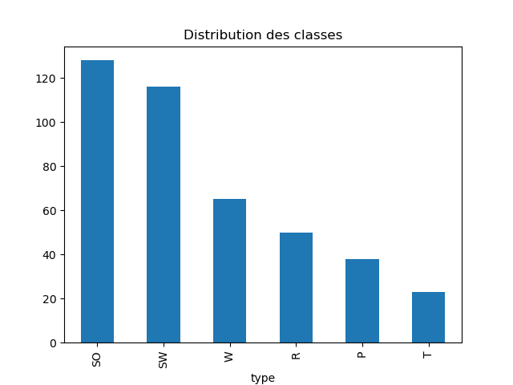
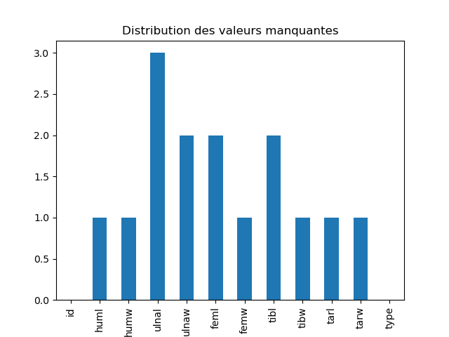
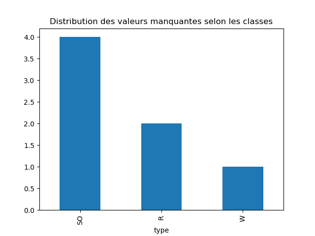
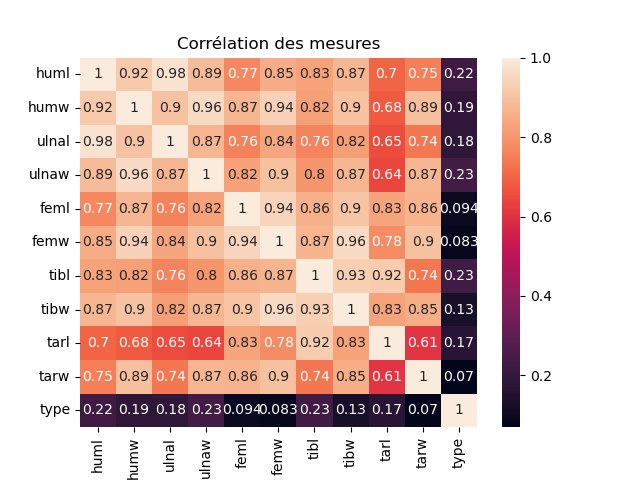
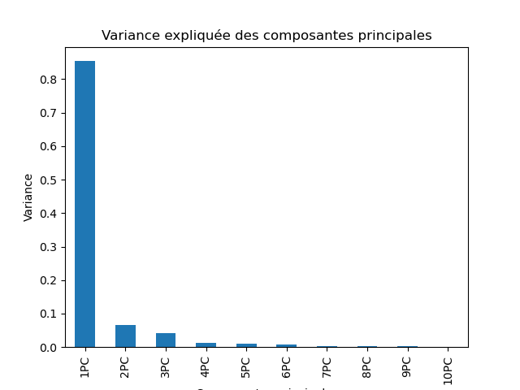
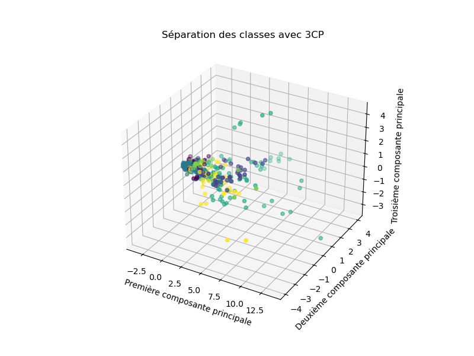
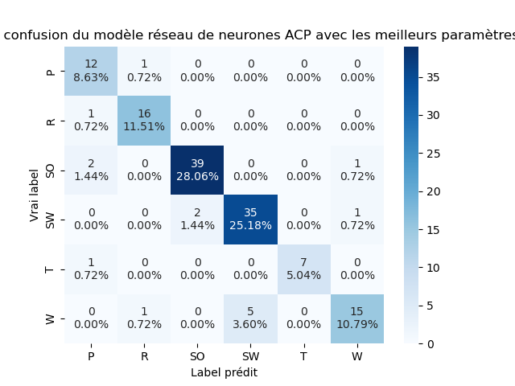

# Introduction

## Problème

Dans le contexte du réchauffement climatique et de la disparition de nombreuses espèces d'animaux, être capable de déterminer à quel groupe écologique appartient la dépouille d'un oiseau pourrait nous permettre de prévenir la disparition de ce dernier. Notre projet ne s'inscrirait pas en tant que finalité dans ce procédé mais plutôt comme un outil initial.

De multiples espèces d'oiseaux peuplent notre planète, allant des pigeons urbains aux autruches des savanes, en passant par les pingouins des régions polaires. Leurs capacités varient grandement : certains excellents dans l'art du vol, d'autres spécialisés dans la course rapide, ou encore certains maîtres-nageurs sous l'eau, tandis que d'autres préfèrent les eaux peu profondes pour se déplacer.

Les caractéristiques physiques des oiseaux, telles que la robustesse des ailes chez les espèces volantes ou la longueur des jambes chez celles fréquentant les milieux aquatiques peu profonds, témoignent de leur appartenance à un groupe écologique spécifique. En tant que scientifiques des données, notre intérêt se porte sur l'analyse des liens entre la morphologie osseuse et le groupe écologique de chaque espèce.

Notre projet se concentre sur l'exploration et l'analyse de ces relations. L'intérêt principal réside dans l'identification des caractéristiques physiques spécifiques qui distinguent les différents groupes écologiques d'oiseaux, en utilisant les mesures de 420 spécimens d'oiseaux représentant une vaste diversité d'espèces. Ces spécimens sont classifiés en six groupes écologiques principaux, sur la base de leurs habitudes de vie et de leur adaptation à leur environnement.

Notre objectif est d'établir un modèle de prédiction du type d'oiseau uniquement à partir des relations identifiées dans la mesure des os. C'est une tache de classification multi-classe que nous allons explorer à l'aide d'algorithmes d'apprentissage automatiques.

## Travaux connexes

De nos jours, une grande partie des travaux effectués sur la reconnaissance des oiseaux sont des tâches de reconnaissance visuelle [@rai2022recognition ; @adhikari2021comprehensive]. Des modèles de deep-learning comme les Réseaux Neuronaux Convolutifs sont notammenet utilisés, en plus de modèles standards comme les classifieurs via plus proches voisins et même plus proches centroïdes. Nous utiliserons nous aussi ces modèles mais sur des données numériques.

L'intégration de données supplémentaires, telles que des enregistrements audios en plus d'images, est un domaine de recherche significatif pour améliorer la précision des modèles existant. [@koh2019bird]

# Méthode

## Données

### Description

{ width=300px }

Nous avons utilisé un jeu de données Kaggle [@zjf2017] comprenant près de 500 espèce d'oiseaux classées par groupes écologiques selon les mesures de leurs os. Les mesures décrites sont les suivantes.

- Longueur et diamètre du humérus (`huml` et `humw`)
- Longueur et diamètre de l'ulna/cubitus (`ulnal` et `ulnaw`)
- Longueur et diamètre du fémur (`femul` et `femuw`)
- Longueur et diamètre du tibiotarse/tibia (`tibl` et `tibw`)
- Longueur et diamètre du tarsométatarsien (`tarl` et `tarw`)

Toutes ces mesures sont des nombres flottants continus exprimés en millimètres. Les squelettes inclus dans ce jeu de données proviennent des collections du Musée d'Histoire Naturelle du Comté de Los Angeles. Ils appartiennent à 21 ordres, 153 genres et 245 espèces différentes.

Les classes assignées possibles sont les suivantes.

- `SW` : Oiseaux nageurs
- `W` : Oiseaux échassiers
- `T` : Oiseaux terrestres
- `R` : Rapaces
- `P` : Oiseaux grimpeurs
- `SO` : Oiseaux chanteurs

Ces labels facilitent l'analyse comparative et la classification en fonction des habitudes de vie et des habitats des différentes espèces d'oiseaux. C’est ce qu’on cherche donc à prédire.

Au total, nous comptons alors `11` attributs exploitables pour établir un modèle de prédiction de groupes écologiques. La diversité des mesures fournies permet une exploration détaillée de la morphologie des oiseaux et offre la possibilité d'étudier les relations entre la structure osseuse et les adaptations écologiques.

|       | huml | humw | ulnal | ulnaw |  feml | femw | tibl | tibw |  tarl |  tarw |
| :---- | ---: | ---: | ----: | ----: | ----: | ---: | ---: | ---: | ----: | ----: |
| count |  419 |  419 |   417 |   418 |   418 |  419 |  418 |  419 |   419 |   419 |
| mean  | 64.6 |  4.3 |  69.1 |   3.5 |  36.8 |  3.2 | 64.6 |  3.1 | 39.23 |   2.9 |
| std   | 53.8 |  2.8 |  58.7 |   2.1 |  19.9 |  2.0 | 37.8 |  2.0 |  23.1 |   2.1 |
| min   |  9.8 |  1.1 |  14.0 |     1 |  11.8 |  0.9 |  5.5 |  0.8 |   7.7 |   0.6 |
| 25%   | 25.1 |  2.1 |  28.0 |   1.8 |  21.2 |  1.7 | 36.4 |  1.5 |    23 | 1.425 |
| 50%   | 44.1 |  3.5 |  43.7 |   2.9 |  31.1 |  2.5 | 52.1 |  2.4 |  31.7 |   2.2 |
| 75%   | 90.3 |  5.8 |  97.5 |   4.7 |  47.1 |  4.1 | 82.8 |  4.2 |  50.2 |   3.5 |
| max   |  420 | 17.8 |   422 |    12 | 117.0 | 11.6 |  240 |   11 |   175 |    14 |
Table: Caractéristiques statistiques du jeu de données

La Table 1 ci-dessus décrit les caractéristiques statistiques du jeu de données. On observe tout de suite un faible écart-type sur les mesures `humw`, `ulnaw`, `femw`, `tibw` et `tarw`. Soit ces données impactent beaucoup le groupe écologique avec de faibles variations, soit elles n'ont pas beaucoup d'impact sur ce dernier. Une fois le pré-traitement du jeu de données effectué, on pourra identifier de quel côté de cette hypothèse ces mesures se trouvent en analysant leur corrélation au groupe écologique. 

La Figure 2 montre que la distribution des classes est déséquilibrée. En effet, les classes `SO` et `SW` sont les plus représentées à 30% du dataset chacune. Le reste des classes représente chacunes autour de 10% du dataset. À première vu, ce déséquilibre ne semble pas énorme mais si on observe par exemple un sur-apprentissage lors de l'entraînement de nos modèles de prédiction plus tard, on pourra effectuer un sous-échantillonage des classes majoritaires afin de palier à ce problème.

Aussi, nous avons comparé les lignes dupliquées avec et sans la colonne id qui pourrait inclure un biais sur l'unicité des lignes et nous avons trouvé que les deux valeurs sont les mêmes, donc nous pouvons conclure que le dataframe n'a pas de lignes dupliquées.

Dans la Figure 3, on constate que nous avons 15 valeurs manquantes. Ces dernières proviennent principalement des attributs `ulnal`, `ulnaw`, `feml` et `tibl`. Elles ne sont pas manquantes par hasard. En effet, les espèces concernées ne possèdent tout siplement pas ces os. Il sera néanmois nécéssaire de remplir ces valeurs lors du prétraitement des données afin de pouvoir exploiter les données des oiseaux concernés.

On observe dans la Figure 4 que les os manquant sont les proviennent principalement du groupe des oiseaux nageurs (`SW`). L'ulna/cubitus est un os présent dans l'aile des oiseaux. Les oiseaux nageurs n'en ont pas autant besoin puisqu'ils peuvent aussi nager, donc la disparition de ce dernier chez certaines espèces est cohérente.

### Pré-traitement

Afin de remplacer les valeurs manquantes dans le jeu de données, on utilise la fonction `DataFrame.interpolate` de `pandas` pour les remplacer par le plus proche voisin.

Ensuite, on normalise les classes assignées en les remplaçant par des valeurs numériques allant de 0 au nombre de classes possibles.

Enfin, nous avons normalisé les valeurs numériques de notre jeu de données. Cela est important dans de nombreux algorithmes d'apprentissage automatique car cela peut aider à améliorer les performances et la convergence de l'algorithme. En effet, les valeurs aberrantes peuvent avoir un impact disproportionné sur certains algorithmes si elles ne sont pas mises à l'échelle. La mise à l'échelle peut aider à atténuer cet effet. Aussi, certains algorithmes d'apprentissage automatique, en particulier ceux basés sur des méthodes de gradient, convergent plus rapidement lorsque les caractéristiques sont mises à l'échelle.

### Analyse

Dans la Figure 5, on observe une corrélation très importante entre les caractéristiques, presque à 1 pour certains attributs, qui est la valeur maximale.

Précédémment, nous avions fait l'hypothèse que les caractéristiques `humw`, `ulnaw`, `femw`, `tibw` et `tarw` sont soit très corrélées, soit très peu corrélées à la classe de l'oiseau.

|Caractéristique|Corrélation|Conclusion|
|-|-|-|
|`humw`|0.19|Cette caractéristique est plutôt importante|
|`ulnaw`|0.23|Cette caractéristique est plutôt importante|
|`femw`|0.083|Cette caractéristique est peu importante|
|`tibw`|0.13|Cette caractéristique est plutôt importante|
|`tarw`|0.07|Cette caractéristique est peu importante|
Table: Conclusions vis-à-vis de l'hypothèse énoncée

Les attributs jumeauxs, c'est-à-dire `longueur` et `largeur` des os, ont pour la plupart une forte corrélation ce qui est intuitivement logique puisqu'il est rare qu'un os soit cubique, en général, plus il est long, plus il est fin.
Cependant, il existe tout de même des attributs jumeaux moins corrélés que les autres comme `tarl` et `tarw` qui ont une corrélation de `0.61`, ce qui est relativement faible comparés aux autres attributs.

On trouve aussi des corrélations surprenantes d'os non jumeaux comme `tibl` et `tarl`. Ces deux mesures correspondent à la longeur des os `Tibiotarse` et `Tarsométatarse` qui sont tous les deux connectés, ce qui pourrait expliquer cette corrélation.

Non seulement `tarl` est le plus corrélé avec `tibl`, mais il est aussi le moins corrélé avec sa mesure jumelle `tarw`, contrairement aux autres attributs !

Enfin, on observe que `feml`, `femw` et `tarw` n'ont pratiquement pas d'influence sur le type d'oiseau avec une corrélation de moins de `0.1`.

### Analyse des composantes principales

Dans la Figure 6, on observe tout de suite que la première composante comporte la majorité des informations à près de `85%`. Les deux suivantes n'ont même pas `1%`. Notre jeu de données a ainsi le potentiel d'être réduit à presque une seule composante. En pratique, nos résultats étaient satisfaisants avec au moins 3 composantes. (Voir résultats)

## Prédiction

Afin d'entraîner des modèles de prédiction, nous avons séparé nos données en deux groupes `train` et `test` avec un ratio `1:2`. Il y a donc `281` données dans `train` et `139` dans `test`. Nous avons aussi décidé de comparer les performances des modèles avec les données brut en entrée aux modèles avec les trois premières composantes principales de notre `ACP`.

Les modèles testés sont les suivants.

- **KNN Plus Proches Voisins (KNN)** utilisé pour la classification et la régression. Il fonctionne en attribuant une classe à un point de données en fonction des classes des k points de données les plus proches.
- **Régression Logistique (RL)** utilisé pour prédire la probabilité qu'un événement ait lieu en se basant sur un ensemble d'entrées. ", principalement utilisé pour la classification binaire.
- **Plus proche centroïde (PPC)** algorithme de classification basé sur la similarité entre les caractéristiques d'un point de données et celles du centroïde de chaque classe. Il attribue une classe à un point en fonction de la proximité de ses caractéristiques au centroïde de chaque classe.
- **Réseau de neurones (MLP)** composé de neurones interconnectés, capable d'apprendre à partir de données non structurées et est largement utilisé dans divers domaines tels que la vision par ordinateur et le traitement du langage naturel.
- **Random Forest (RF)** algorithme d'apprentissage supervisé utilisé pour la classification, la régression et d'autres tâches. Il crée un ensemble de nombreux arbres de décision et combine leurs prédictions pour obtenir une prédiction finale.

# Résultats

|Modèle|Précision naïve données brutes|Précision naïve 4CP|Précision optimisée données brutes|Precision optimisée 4CP|
|-|-|-|-|-|
|KNN|0.77|0.74|0.87|0.87|
|RL|0.77|0.65|0.84|0.67|
|PPC|0.46|0.46|0.48|0.50|
|**MLP**|**0.92**|**0.89**|**0.92**|**0.89**|
|RF|0.82|0.82|0.82|0.82|

Le modèle le plus précis est le réseau de neurones avec une précision de `92%` avec données brutes et `89%` avec 4 premières composantes principales. 

Nous constatons dans les Figures 8 et 9 que le modèle perd de la précision lorsqu'il doit différencier les oiseaux nageurs (`SW`) et les oiseaux échassiers (`W`). Les oiseaux échassiers, bien que non nageurs, ont eux aussi des habitats aquatiques. Ils ont ainsi certainement des similarités au niveau de leur os expliquant cette confusion. Sans considérer d'autres caractéristiques morphologiques ou comportementales, notre modèle peut avoir du mal à distinguer ces deux groupes, car il ne capture pas les différences subtiles mais importantes entre eux.

Comparé à des modèles de détection par image ou son d'espèces d'oiseaux, nous avons une précision légèrement plus faible. Ces modèles ont une précision de près de `95%` [@adhikari2021comprehensive] ; les caractéristiques apprises par ces derniers prennent donc certainement en compte les différences subtiles entre les différents groupes écologiques.

# Conclusion

Le modèle de prédiction que nous avons établi est capable de prédire avec une précision de `92%` de quel groupe écologique provient un oiseau en utilisant les mesures des ses os. Grâce à l'analyse des composantes principales du jeu de données utilisé, nous avons réussi à réduire ces mesures à seulement 4 dimensions. Notre modèle n'est tout de même pas capable de distinguer les différences subtiles entre certain groupes écologiques.

Il pourrait néanmoins être utilisé comme première étape d'une pipeline de détection d'éspèce d'oiseau qui ensuite utiliserait une photographie de l'oiseau et peut-être même les sons produits par ce dernier, par exemple.

\clearpage